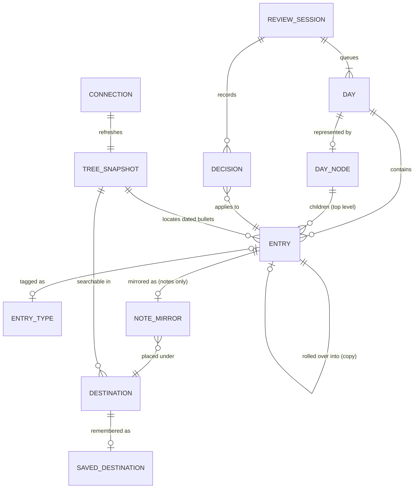

# Entity Map

Entities live in one of two places:
- **WorkFlowy** — the source of truth for days, entries, types (tags), completion, and mirrors. The app reads and writes them via the WorkFlowy API.
- **Local (app storage)** — things WorkFlowy can't hold: review sessions and their undo history, saved destinations, the tree snapshot, and the API connection.

## Diagram

## Entities

### Day
**Description**: A calendar date plus all its entries: the top-level children of its `DayNode` and every `DatedBullet` carrying that date anywhere in the tree.
**Instances per user**: Many (one per date that has entries)
**Ownership**: Derived — computed from WorkFlowy data, not stored
**Lifecycle**: Exists as soon as any entry belongs to the date. Never deleted.
**States**: `open` → `closed` (derived: `isClosed` = every entry has a type and no task is open). Can reopen if an entry is changed back (e.g. undo, or a new untyped entry appears).
**Contains**: Entry
**Belongs to**: —

### DayNode
**Description**: The WorkFlowy calendar node for a specific date. Addressable via API as `"YYYY-MM-DD"`, `"today"`, `"tomorrow"`; the API creates it when needed.
**Instances per user**: Many (one per date)
**Ownership**: User (WorkFlowy)
**Lifecycle**: Created by WorkFlowy (or implicitly by the API when the app writes to `"today"` / `"tomorrow"`). The app never deletes it.
**States**: —
**Contains**: Entry (top-level children)
**Belongs to**: WorkFlowy calendar

### Entry
**Description**: A single top-level WorkFlowy bullet belonging to a day — either a direct child of the `DayNode` or a `DatedBullet` located anywhere in the tree. The unit being processed. Its children are content that travels with it (copied on roll-over, mirrored with a note); they are never separate entries.
**Instances per user**: Many
**Ownership**: User (WorkFlowy)
**Lifecycle**: Created by the user in WorkFlowy (or by the app as a roll-over copy). Ends as a typed record (note/event), a completed task, or is permanently deleted.
**States**:
- `untyped` → `task` / `note` / `event` (classification; the type can be changed later)
- Task: `open` → `done` | `migrated` (rolled over) | `irrelevant` — all three are completed in WorkFlowy
- Any state → `deleted` (permanent, not undoable)
**Contains**: child bullets (as content)
**Belongs to**: Day (via DayNode or its date)

### EntryType
**Description**: The Bullet Journal classification of an entry, persisted as a fixed tag in WorkFlowy: `#task`, `#note`, `#event`. Additional fixed outcome tags: `#migrated`, `#irrelevant`. A done task gets no extra tag — WorkFlowy's completed state is enough. Tags typed manually in WorkFlowy are respected.
**Instances per user**: Fixed set (hard-coded in the app)
**Ownership**: System
**Lifecycle**: Static
**States**: —
**Contains**: —
**Belongs to**: —

### NoteMirror
**Description**: A WorkFlowy mirror (live copy) of a note, created under a chosen destination. The note itself stays in its day. At most one mirror per note.
**Instances per user**: Many (max one per note)
**Ownership**: User (WorkFlowy)
**Lifecycle**: Created when the user files a note during classification. Removed via undo (`DELETE /nodes/:id/mirror`).
**States**: —
**Contains**: —
**Belongs to**: Entry (note), Destination

### Destination
**Description**: A WorkFlowy node a note can be mirrored under. Found by searching the tree snapshot.
**Instances per user**: Many (any node in the tree)
**Ownership**: User (WorkFlowy)
**Lifecycle**: Lives in WorkFlowy; the app only references it.
**States**: —
**Contains**: NoteMirror
**Belongs to**: WorkFlowy tree

### SavedDestination
**Description**: A remembered destination for quick access, so the user doesn't have to search every time. Two kinds: `recent` (automatic, last few used) and `pinned` (favorites the user pins/unpins).
**Instances per user**: Many (a short recent list + any number of pinned)
**Ownership**: User (local)
**Lifecycle**: Recent entries are added on use and fall off as newer ones arrive; pinned ones live until unpinned.
**States**: `recent`, `pinned`
**Contains**: —
**Belongs to**: Destination

### ReviewSession
**Description**: A resumable run through a queue of entries, one at a time, with an undo history. Lasts until the user explicitly ends it — possibly across many days and app restarts.
**Instances per user**: At most one active session per mode
**Ownership**: User (local)
**Lifecycle**: Started by the user; persists locally; ended by the user. On end, its decision history is discarded.
**Modes**:
- `today` — today's entries, started from the Today list. Tasks can be done, irrelevant, left open, or rolled over to **tomorrow**.
- `yesterday` — the morning review of yesterday. Tasks roll over to **today**.
- `backlog` — a queue of open days older than yesterday, oldest first. Tasks roll over to **today**.
**States**: `active` → `ended`
**Contains**: Decision; references a queue of Days → Entries
**Belongs to**: —

### Decision
**Description**: One recorded processing step in a session (classify, change type, done, roll over, irrelevant, leave open, mirror note), stored with enough information to undo it. Delete is recorded but cannot be undone.
**Instances per user**: Many per session
**Ownership**: User (local)
**Lifecycle**: Created on every decision; removed when undone or when the session ends.
**States**: `applied` → `undone`
**Contains**: —
**Belongs to**: ReviewSession, Entry

### TreeSnapshot
**Description**: A local cache of the whole WorkFlowy tree from `GET /nodes-export` (rate-limited to 1 request/minute). Needed because the API has no search or tag/date query endpoints: used to find dated bullets and to search destinations.
**Instances per user**: One
**Ownership**: System (local)
**Lifecycle**: Refreshed periodically and on demand (within the rate limit).
**States**: `fresh` / `stale` / `refreshing`
**Contains**: —
**Belongs to**: Connection

### Connection
**Description**: The link to the user's WorkFlowy account — the API key, stored locally.
**Instances per user**: One
**Ownership**: User (local)
**Lifecycle**: Set up on first use; can be changed or removed.
**States**: `disconnected` → `connected` (→ `invalid` if the key stops working)
**Contains**: —
**Belongs to**: —

## Derived views

- **Backlog** — the queue of every past day older than yesterday that is not closed, from the beginning of the calendar, oldest first.
- **Today list** — a plain list of today's entries with quick typing; the entry point to a `today` session.
