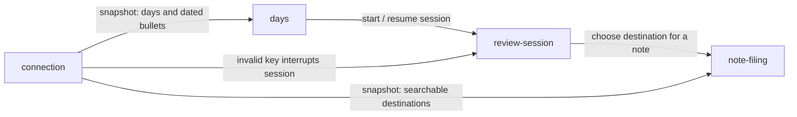

# Module Breakdown

## Overview
The app breaks down into four design modules. One **core** module (`review-session`) carries the whole value of the product: the guided, one-entry-at-a-time Bullet Journal review. Two **supporting** modules feed it — `note-filing` (where a note gets mirrored) and `days` (which days exist, what state they're in, and how a session is started). One **generic** module (`connection`) holds the WorkFlowy API key and the local tree snapshot that everything else reads from.

## Modules

### review-session
**Type**: Core
**Description**: The guided queue where the user processes entries one at a time, in one of three modes (`today`, `yesterday`, `backlog`). Each entry gets a small fixed set of decisions; every decision is recorded so it can be undone. Sessions are resumable across days and app restarts.
**Entities**: ReviewSession, Decision, Entry, EntryType
**Key Actions**:
- Start / resume / end session, skip to next entry
- Classify entry, change type
- Task: mark done, roll over (to today or tomorrow), mark irrelevant, leave open (`today` mode only)
- Event: keep as record
- Delete entry (confirmed, not undoable)
- Undo decision
**Connects to**:
- `days` → review-session: a session is started from the Today list, the yesterday review entry point, or the Backlog
- review-session → `note-filing`: choosing a destination when a note is classified
- `connection` → review-session: an `invalid` key interrupts the session
**Design priority**: High — this is the one screen the user lives in. It must stay calm and low-friction for an easily overwhelmed user (one entry, few decisions, nudge rather than force), and it carries the most complexity: three modes with different roll-over targets, undo history, resumability.

---

### note-filing
**Type**: Supporting
**Description**: The sub-flow for filing a note: pick a destination in the WorkFlowy tree and create a mirror of the note there. Offers recent and pinned destinations next to search, so the user rarely has to search from scratch.
**Entities**: NoteMirror, Destination, SavedDestination
**Key Actions**:
- Search destination, pick recent destination, pick pinned destination
- Pin / unpin destination
- Mirror to destination (max one mirror per note), or keep the note in its day
**Connects to**:
- review-session → note-filing: opened when a note is classified
- `connection` → note-filing: destinations are searched in the tree snapshot
**Design priority**: Medium — contained, but search over a whole tree plus three sources of destinations is the most interaction-heavy step inside the review flow. Must not break the one-at-a-time rhythm.

---

### days
**Type**: Supporting
**Description**: Overview of days and their status, and the entry points into sessions. Shows today's entries as a plain list with quick typing, and the Backlog of open past days, oldest first.
**Entities**: Day, DayNode (plus the derived views Today list and Backlog)
**Key Actions**:
- View Today list, quick-type an entry from it
- View Backlog
- View day status (open / closed, what is left)
- Start today session, start yesterday review, start backlog session, resume an active session
**Connects to**:
- days → review-session: starts and resumes sessions in all three modes
- `connection` → days: days and dated bullets are derived from the tree snapshot
**Design priority**: Medium — the Backlog (a long tail of open days since the calendar began) can easily overwhelm; how it is presented matters. The rest is a straightforward list.

---

### connection
**Type**: Generic
**Description**: Setup and health of the link to WorkFlowy: the API key stored locally and the cached tree snapshot (refreshable once per minute at most).
**Entities**: Connection, TreeSnapshot
**Key Actions**:
- Connect WorkFlowy, change API key, disconnect
- Refresh snapshot (manual and automatic)
**Connects to**:
- connection → days, note-filing: snapshot is the data source for days, dated bullets and destinations
- connection → review-session: `invalid` key state interrupts a session
**Design priority**: Low — standard settings-style screens. The only part worth care is the snapshot's `fresh` / `stale` / `refreshing` states and the first-run connect flow.

---

## Integration Map

## Prototyping Order

1. **review-session** — core module; everything else exists to feed it or branch from it, and it holds the most UX risk.
2. **note-filing** — plugs directly into note classification, so it is best designed while the card flow is fresh.
3. **days** — adds the entry points (Today list, Backlog) once there is a session to start.
4. **connection** — generic setup; last, because the prototype can run on mock data until then.

## Priority Areas

- **review-session / entry card**: how many decisions are visible at once, the tone ("nudge, not force"), and how undo feels. This is the whole product.
- **days / Backlog**: presenting a long tail of open days without overwhelming the user.
- **note-filing / destination picker**: keeping a tree search fast enough not to break the one-at-a-time rhythm.
